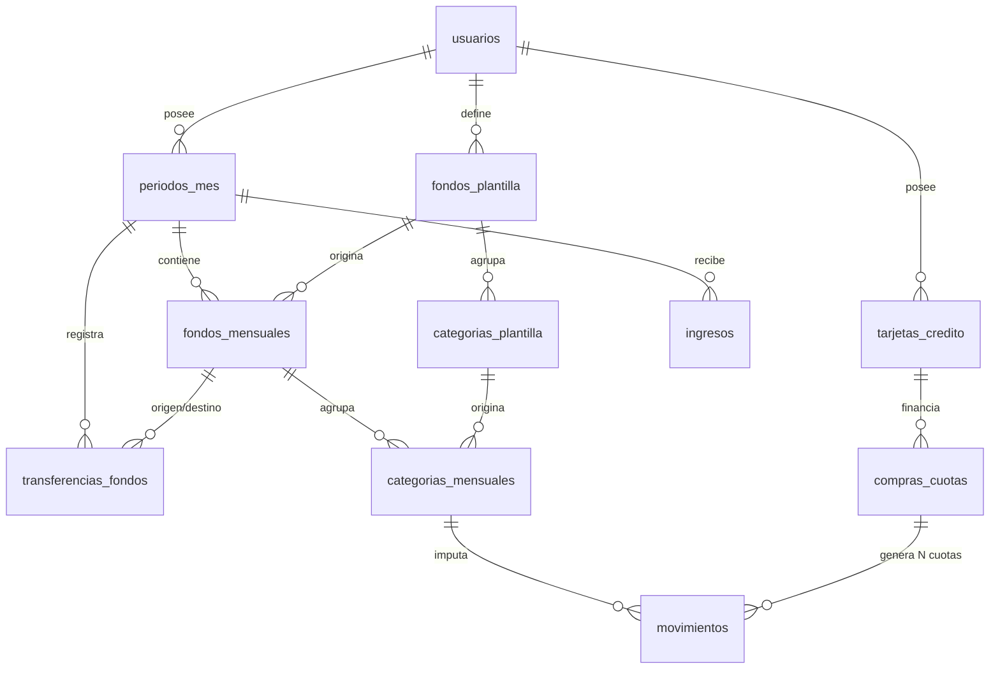
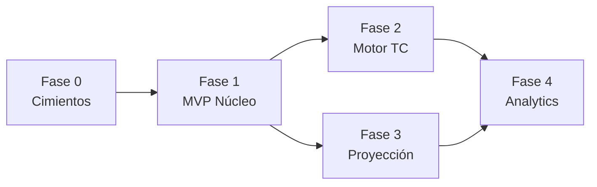

# Master Blueprint — App de Finanzas Personales (ZBB + Motor de Cuotas)

> Estado actual del repo: Vite + React 19 + Supabase JS + Tailwind. El plan parte de esa base y la formaliza.

---

## 1. Stack Tecnológico Recomendado

### 1.1 Decisión principal: mantener Vite + React + Supabase

| Capa | Elección | Justificación |
|---|---|---|
| **Frontend** | React 19 + Vite | Ya está en el repo. HMR instantáneo, build rápido, cero config de SSR que no necesitas (app privada tras login, no requiere SEO). |
| **Estilos** | TailwindCSS v3 + `clsx` | Velocidad de prototipado; evita CSS Modules dispersos. **Nota:** actualmente `src/index.css` fue reseteado — hay que restaurar las directivas `@tailwind`. |
| **Backend** | Supabase (PostgREST + Edge Functions) | Elimina la necesidad de un servidor Node propio. `supabase-js` habla directo con Postgres vía REST con RLS. Menos código, menos deploy. |
| **Base de Datos** | PostgreSQL (Supabase) | Necesitas transacciones ACID reales (generar 12 cuotas debe ser atómico), tipos `date`, `numeric(14,2)` y constraints. |
| **Lógica crítica** | Funciones SQL (`plpgsql`) invocadas por RPC | Operaciones multi-tabla (cerrar mes, generar cuotas, transferir fondos) deben ser atómicas. Ver §1.4. |
| **Auth** | Supabase Auth (email + magic link) | `auth.uid()` se integra nativamente con RLS. Cero backend de sesiones. |
| **Migraciones** | Supabase CLI (`supabase/migrations/*.sql`) | Versiona el esquema en Git. **Crítico**: hoy el esquema vive solo en la nube, sin historial. |
| **Routing** | React Router v6 | Rutas: `/`, `/mes/:periodo`, `/tarjetas`, `/configuracion`. |

### 1.2 Alternativa descartada (y por qué)

- **Next.js + Prisma + Node/Express**: más potente, pero triplica la superficie de mantenimiento (servidor propio, deploy, ORM, migraciones separadas, API routes). Para un proyecto de un solo desarrollador con un solo usuario primario, es sobre-ingeniería. Supabase cubre auth + DB + API + storage.

### 1.3 Estrategia de Estado

Tres niveles, sin Redux:

```
┌─ Server State ──────► TanStack Query (React Query v5)
│                       queryKey: ['resumen', usuarioId, periodo]
│                       Invalidación automática tras mutaciones.
│                       Resuelve el bug recurrente de "la UI no se
│                       actualiza tras guardar".
│
├─ Global UI State ───► React Context (AuthContext, PeriodoContext)
│                       Solo: usuario logueado + mes seleccionado.
│
└─ Local State ───────► useState / useReducer en el componente
                        Formularios, modales, toggles.
```

**Regla de oro:** ningún dato de Supabase se guarda en `useState`. Todo pasa por React Query. Esto elimina la clase entera de bugs de sincronización que ya apareció en el asistente de inicialización.

### 1.4 Estrategia de Autenticación y Seguridad

- **Auth**: `supabase.auth.signInWithOtp()` (magic link) — sin gestión de contraseñas.
- **RLS obligatorio en todas las tablas** desde la Fase 0:
  ```sql
  ALTER TABLE fondos_mensuales ENABLE ROW LEVEL SECURITY;
  CREATE POLICY "propietario" ON fondos_mensuales
    USING (usuario_id = auth.uid());
  ```
- **Nunca** usar `service_role key` en el frontend. Solo `anon key` + RLS.
- **Nunca** hardcodear `usuarioId` (hoy hay un UUID fijo `00000000-...` en el código; debe salir de `auth.uid()`).
- Validación de `.env`: fallar ruidosamente al arrancar si faltan `VITE_SUPABASE_URL` / `VITE_SUPABASE_ANON_KEY`, en vez de degradar silenciosamente.

---

## 2. Arquitectura de Datos & Diagrama ER

### 2.1 Principio rector: Plantilla ≠ Instancia Mensual

Esta es **la decisión arquitectónica más importante** del proyecto.

- **Plantillas** (`*_plantilla`): la estructura ideal y reutilizable. Cambiarlas NO afecta meses ya cerrados.
- **Instancias mensuales** (`*_mensuales`): copias congeladas por periodo. Es lo que el usuario edita día a día.

Esto resuelve el problema de duplicación que ya apareció: la inicialización de mes es un **snapshot** de la plantilla, no un `INSERT` ciego.

### 2.2 Diagrama ER



### 2.3 Especificación de tablas

#### `usuarios`
Gestionado por `auth.users` de Supabase. Tabla `perfiles` opcional para `moneda_default`, `dia_inicio_mes`.

#### `periodos_mes`
| Columna | Tipo | Notas |
|---|---|---|
| `id` | uuid PK | |
| `usuario_id` | uuid FK | |
| `periodo` | date | Siempre día 1: `2026-08-01` |
| `estado` | enum | `borrador` \| `activo` \| `cerrado` |
| `inicializado_at` | timestamptz | null = mes vacío |

> **Constraint clave:** `UNIQUE(usuario_id, periodo)`. Esto es lo que hace imposible duplicar un mes.

#### `fondos_plantilla` / `categorias_plantilla`
| Columna | Tipo | Notas |
|---|---|---|
| `id` | uuid PK | |
| `usuario_id` | uuid FK | |
| `nombre` | text | `UNIQUE(usuario_id, nombre)` |
| `monto_sugerido` | numeric(14,2) | Valor por defecto al clonar |
| `tipo` | enum | `gasto` \| `ahorro` \| `inversion` \| `deuda` |
| `prioridad` | int | Orden de cobro. Ahorro/Inversión = prioridad alta |
| `activo` | boolean | Soft delete |

`categorias_plantilla` añade `fondo_plantilla_id` FK + `UNIQUE(fondo_plantilla_id, nombre)`.

#### `fondos_mensuales` / `categorias_mensuales`
| Columna | Tipo | Notas |
|---|---|---|
| `id` | uuid PK | |
| `periodo_id` | uuid FK | |
| `plantilla_id` | uuid FK nullable | Traza el origen; null si es ad-hoc |
| `nombre` | text | Copiado (permite renombrar sin tocar plantilla) |
| `monto_presupuestado` | numeric(14,2) | |

> **Constraints anti-duplicado (obligatorios):**
> ```sql
> UNIQUE(periodo_id, nombre)                    -- en fondos_mensuales
> UNIQUE(fondo_mensual_id, nombre)              -- en categorias_mensuales
> ```
> Con esto, un `INSERT ... ON CONFLICT DO UPDATE` reemplaza el "upsert manual" hecho en el cliente. La DB garantiza la unicidad, no el frontend.

#### `ingresos`
| Columna | Tipo | Notas |
|---|---|---|
| `periodo_id` | uuid FK | |
| `descripcion` | text | |
| `monto` | numeric(14,2) | `CHECK (monto > 0)` |
| `es_fijo` | boolean | Se clona al inicializar el mes siguiente |
| `fecha` | date | |

#### `movimientos` (tabla central de gastos)
| Columna | Tipo | Notas |
|---|---|---|
| `id` | uuid PK | |
| `usuario_id` | uuid FK | Denormalizado para RLS eficiente |
| `categoria_mensual_id` | uuid FK | **Determina a qué mes/fondo impacta** |
| `descripcion` | text | |
| `monto` | numeric(14,2) | **Monto específico de ESTA cuota en ESTE periodo.** Ver nota abajo |
| `fecha_transaccion` | date | Cuándo se compró (real) |
| `medio_pago` | enum | `efectivo` \| `debito` \| `credito` \| `transferencia` |
| `compra_cuota_id` | uuid FK nullable | Si viene del motor de cuotas |
| `numero_cuota` | int nullable | 1..N |
| `total_cuotas` | int nullable | |
| `monto_teorico` | numeric(14,2) nullable | Valor proyectado original (`monto_total / cantidad_cuotas`). Permite detectar desvíos |
| `ajustado_manualmente` | boolean | Default `false`. Se marca `true` si el usuario editó el monto de esta cuota |

> **Regla de negocio crítica:** `fecha_transaccion` ≠ mes de impacto. El mes de impacto lo define `categoria_mensual_id → fondo_mensual → periodo`. Una compra del 28/08 con tarjeta que cierra el 25 impacta el periodo `2026-10-01`.

> **Independencia de cada cuota:** el campo `monto` representa el importe de **esa cuota específica para ese periodo específico**. Cada fila de `movimientos` con `compra_cuota_id IS NOT NULL` es una entidad autónoma. Editar la cuota 4 de 12 (porque el resumen llegó con un ajuste por inflación o un interés no previsto) **no** altera automáticamente las cuotas 1–3 (pasadas) ni las 5–12 (futuras). El recálculo en cascada solo ocurre si el usuario lo solicita explícitamente. Ver **R7**.

#### `tarjetas_credito`
| Columna | Tipo | Notas |
|---|---|---|
| `nombre` | text | |
| `limite_total` | numeric(14,2) | |
| `dia_cierre` | int | `CHECK (1..31)` |
| `dia_vencimiento` | int | `CHECK (1..31)` |
| `mes_impacto_offset` | int | 0 o 1. Si vence el mes siguiente al cierre |

#### `compras_cuotas`
| Columna | Tipo | Notas |
|---|---|---|
| `tarjeta_id` | uuid FK | |
| `descripcion` | text | |
| `monto_total` | numeric(14,2) | |
| `cantidad_cuotas` | int | `CHECK (>= 1)` |
| `fecha_compra` | date | |
| `primer_periodo_impacto` | date | **Calculado** por la regla de cierre |
| `categoria_plantilla_id` | uuid FK | A qué categoría imputar cada cuota |
| `es_monto_variable` | boolean | Default `false`. `true` = plan con cuotas ajustables (inflación, interés variable, refinanciación). Habilita en la UI el flujo de ajuste por cuota |

> **Sobre `es_monto_variable`:** cuando es `false`, la UI asume que todas las cuotas valen lo mismo y advierte si alguna difiere. Cuando es `true`, la UI presenta la compra como un plan de pagos con montos por confirmar mes a mes, y `monto_total` pasa a ser una estimación inicial en lugar de un valor cerrado.
>
> **Trazabilidad:** el total realmente pagado se obtiene sumando los `movimientos` asociados, no leyendo `monto_total`. Ese campo conserva el valor pactado al momento de la compra para poder comparar proyección vs. realidad.

#### `transferencias_fondos`
| Columna | Tipo | Notas |
|---|---|---|
| `periodo_id` | uuid FK | |
| `fondo_origen_id` | uuid FK | |
| `fondo_destino_id` | uuid FK | `CHECK (origen <> destino)` |
| `monto` | numeric(14,2) | `CHECK (monto > 0)` |
| `motivo` | text | |

### 2.4 Vistas materializadas / calculadas

En vez de calcular totales en JS (fuente de bugs), usar **vistas SQL**:

```sql
CREATE VIEW v_resumen_periodo AS ...
-- devuelve: total_ingresos, total_presupuestado, total_gastado,
--           dinero_sin_asignar, por cada periodo_id
```

El frontend hace un solo `select` a la vista. Cero aritmética duplicada entre cliente y servidor.

Vista adicional para el seguimiento de planes de cuotas:

```sql
CREATE VIEW v_estado_compra_cuotas AS ...
-- por cada compras_cuotas.id devuelve:
--   monto_total_pactado      -- valor original
--   monto_real_acumulado     -- SUM(movimientos.monto)
--   desvio                   -- real - pactado
--   cuotas_pagadas           -- las de periodos cerrados
--   cuotas_pendientes
--   saldo_pendiente          -- SUM de cuotas en periodos no cerrados
--   tiene_ajustes_manuales   -- bool_or(ajustado_manualmente)
```

### 2.5 Catálogo de Funciones RPC

Toda operación multi-tabla vive en la base de datos. Contrato de cada una:

| RPC | Firma | Responsabilidad |
|---|---|---|
| `inicializar_periodo` | `(p_periodo date)` | Crea el periodo, clona fondos/categorías desde plantilla y los ingresos fijos. Idempotente |
| `registrar_compra_cuotas` | `(p_tarjeta_id, p_descripcion, p_monto_total, p_cantidad_cuotas, p_fecha_compra, p_categoria_plantilla_id, p_es_monto_variable)` | Crea la compra + N movimientos con `monto_teorico = monto_total / cantidad_cuotas`. Atómica |
| **`actualizar_cuota_individual`** | `(p_movimiento_id uuid, p_nuevo_monto numeric)` | **Ajusta UNA sola cuota.** Ver detalle abajo |
| `recalcular_cuotas_pendientes` | `(p_compra_cuota_id uuid, p_nuevo_saldo numeric)` | Redistribuye un saldo entre las cuotas de periodos **no cerrados**. No toca el historial |
| `transferir_entre_fondos` | `(p_periodo_id, p_origen_id, p_destino_id, p_monto, p_motivo)` | Movimiento atómico entre fondos |
| `cerrar_periodo` | `(p_periodo date)` | Marca el periodo como `cerrado` y congela sus movimientos |

#### `actualizar_cuota_individual(p_movimiento_id, p_nuevo_monto)`

Pensada para el caso real más frecuente: **llega el resumen de la tarjeta y la cuota vino con un ajuste que no estaba proyectado.**

Comportamiento:

1. Valida que el movimiento pertenezca al usuario (`auth.uid()`) y tenga `compra_cuota_id IS NOT NULL`.
2. Rechaza la operación si el periodo destino está `cerrado` (regla **R5**).
3. Actualiza `monto` y marca `ajustado_manualmente = true`. **No toca `monto_teorico`** — así se conserva la trazabilidad del desvío.
4. **No propaga el cambio** a ninguna otra cuota, ni pasada ni futura.
5. Devuelve el estado actualizado del plan (total pactado, total real, desvío acumulado, saldo pendiente) para que la UI lo muestre sin un round-trip extra.

Si el usuario quiere propagar el ajuste, debe invocar explícitamente `recalcular_cuotas_pendientes`. Son dos operaciones distintas por diseño.

---

## 3. Roadmap por Fases

### Fase 0 — Cimientos (bloqueante)
**Objetivo:** que nada de lo que se construya después haya que rehacerlo.

- Supabase CLI + migraciones versionadas en Git
- Auth real (adiós `usuarioId` hardcodeado)
- RLS en todas las tablas
- React Query + React Router instalados
- Tailwind restaurado
- Estructura de carpetas definitiva

**Salida:** app que loguea, muestra "Hola {email}", y tiene el esquema completo migrado.

---

### Fase 1 — MVP Núcleo (ZBB básico)
**Objetivo:** poder presupuestar y gastar en un mes.

- CRUD de plantillas (fondos + categorías)
- Inicialización de mes desde plantilla (RPC atómica)
- CRUD de ingresos
- Registro de gastos simples (efectivo/débito)
- Dashboard mínimo: Dinero Sin Asignar, Ingresos, Presupuestado

**Salida:** un mes completo gestionable de punta a punta.

---

### Fase 2 — Motor de Tarjetas y Cuotas
**Objetivo:** la funcionalidad diferencial de la app.

- CRUD de tarjetas con `dia_cierre` / `dia_vencimiento`
- Calculadora de `primer_periodo_impacto`
- RPC que genera N movimientos en N periodos futuros (creando periodos si no existen)
- **Soporte para cuotas variables:** ajuste manual de una cuota puntual sin afectar el resto
- Vista "Proyección de cuotas" (qué debo en los próximos 12 meses)
- Edición/eliminación en cascada de una compra en cuotas

**Salida:** registrar "Heladera $600.000 en 12 cuotas" y ver el impacto hasta 2027; y cuando la cuota 4 llegue a $58.300 en vez de $50.000, poder corregir solo esa.

---

### Fase 3 — Proyección Financiera & Transferencias
**Objetivo:** llegar a Dinero Sin Asignar = $0 sin fricción.

- Transferencias entre fondos (RPC atómica)
- Cálculo y visualización de Dinero Sin Asignar en tiempo real
- Prioridad de cobro (Ahorro/Inversión primero)
- Asistente "Auto-asignar sobrante"
- Cierre de mes + arrastre de saldos

---

### Fase 4 — Dashboard & Analytics
**Objetivo:** entender los datos.

- Gráficos de gasto por fondo (Recharts)
- Comparativa presupuestado vs. real
- Evolución de ahorro / deuda TC en el tiempo
- Exportación CSV

---

## 4. Backlog Detallado por Fase

### FASE 0 — Configuración Inicial

| # | Tarea | Criterio de Aceptación | Dependencias |
|---|---|---|---|
| 0.1 | Inicializar Supabase CLI | `supabase/config.toml` existe; `supabase db pull` trae el esquema actual a `supabase/migrations/` | — |
| 0.2 | Escribir migración base del esquema completo | Un `supabase db reset` en local reconstruye TODAS las tablas de §2.3 desde cero, con constraints y enums | 0.1 |
| 0.3 | Añadir constraints UNIQUE anti-duplicado | Intentar insertar dos fondos con mismo `(periodo_id, nombre)` falla con error `23505` | 0.2 |
| 0.4 | Habilitar RLS + políticas por `auth.uid()` | Con la `anon key` y sin sesión, todo `select` devuelve `[]`. Con sesión, solo filas propias | 0.2 |
| 0.5 | Validar variables de entorno al arrancar | Si falta `VITE_SUPABASE_URL`, la app muestra pantalla de error explícita (NO un mock silencioso) | — |
| 0.6 | Instalar y configurar React Router | Rutas `/login`, `/`, `/mes/:periodo`, `/tarjetas`, `/configuracion` responden | — |
| 0.7 | Instalar TanStack Query + `QueryClientProvider` | Devtools visibles en dev; un `useQuery` de prueba cachea correctamente | — |
| 0.8 | Restaurar TailwindCSS | `src/index.css` tiene las 3 directivas `@tailwind`; una clase `bg-indigo-600` renderiza el color | — |
| 0.9 | Implementar `AuthContext` + pantalla de login | Magic link envía email; tras click, `session` disponible en toda la app; logout funciona | 0.4, 0.6 |
| 0.10 | Eliminar `usuarioId` hardcodeado | `grep "00000000-0000"` en `src/` devuelve 0 resultados | 0.9 |
| 0.11 | Definir estructura de carpetas | Existen `src/features/{presupuesto,tarjetas,ingresos}/`, `src/lib/`, `src/components/ui/` | — |
| 0.12 | Configurar ESLint + Prettier + pre-commit | `npm run lint` pasa en CI; commit con error de sintaxis JSX es rechazado | — |

> **Nota sobre 0.12:** esto habría prevenido los tres parse errors de JSX desbalanceado que ya costaron tiempo. Es la tarea con mejor ROI del backlog.

---

### FASE 1 — MVP Núcleo

| # | Tarea | Criterio de Aceptación | Dependencias |
|---|---|---|---|
| 1.1 | Capa `lib/queries/` con hooks tipados | Existe `usePeriodo(periodo)`, `useFondosMensuales(periodoId)`; ninguno usa `useState` para datos del server | 0.7 |
| 1.2 | CRUD `fondos_plantilla` (UI + hooks) | Crear/editar/archivar fondo plantilla; la lista se refresca sola tras mutar | 1.1 |
| 1.3 | CRUD `categorias_plantilla` anidado | Añadir categoría dentro de un fondo; validación de nombre duplicado muestra toast, no crash | 1.2 |
| 1.4 | RPC `inicializar_periodo(p_periodo date)` | Función plpgsql que: crea `periodos_mes`, clona fondos+categorías desde plantilla, clona ingresos fijos. **Todo en una transacción**. Llamarla 2× no duplica nada (idempotente vía `ON CONFLICT`) | 0.3, 1.3 |
| 1.5 | UI Asistente de Inicialización | Modal que precarga la plantilla, permite editar montos y deseleccionar ítems antes de confirmar. Botón se bloquea durante el submit | 1.4 |
| 1.6 | Selector de periodo (mes anterior/siguiente) | Flechas ◀ ▶ cambian la URL a `/mes/2026-09-01` y recargan datos vía React Query | 0.6, 1.1 |
| 1.7 | CRUD de ingresos del mes | Alta/baja/edición; el flag `es_fijo` se respeta en la siguiente inicialización | 1.4 |
| 1.8 | Vista SQL `v_resumen_periodo` | Devuelve `total_ingresos`, `total_presupuestado`, `total_gastado`, `dinero_sin_asignar` en una sola fila por periodo | 0.2 |
| 1.9 | Tarjetas de resumen en Dashboard | Muestran los 4 valores de 1.8, con estado de carga (skeleton) y formato `es-AR` | 1.8 |
| 1.10 | Registro de gasto simple | Formulario: monto, descripción, fecha, categoría. Inserta en `movimientos` con `medio_pago != 'credito'` | 1.4 |
| 1.11 | Lista de fondos con barra de progreso | Cada fondo muestra `gastado / presupuestado` y barra que cambia de color al superar el 100% | 1.10 |
| 1.12 | Estado vacío para mes sin inicializar | Si `periodos_mes` no existe para ese mes, se muestra CTA de inicialización en vez de tarjetas en $0 | 1.5 |

---

### FASE 2 — Motor de Tarjetas y Cuotas

| # | Tarea | Criterio de Aceptación | Dependencias |
|---|---|---|---|
| 2.1 | CRUD `tarjetas_credito` | Alta con `dia_cierre`, `dia_vencimiento`, `limite_total`. Validación 1–31 | 0.4 |
| 2.2 | Función pura `calcularPrimerPeriodoImpacto()` | **Regla:** si `dia(fecha_compra) <= dia_cierre` → impacta el periodo del vencimiento de ese ciclo; si `>` → impacta el ciclo siguiente. Cubierta por tests unitarios | 2.1 |
| 2.3 | Tests de 2.2 con casos borde | Casos cubiertos: compra el día exacto del cierre; compra el día después; compra en diciembre que impacta enero; `dia_cierre = 31` en febrero | 2.2 |
| 2.4 | RPC `registrar_compra_cuotas(...)` | Inserta 1 fila en `compras_cuotas` + N filas en `movimientos` (con `monto_teorico` poblado), creando los `periodos_mes` y `fondos/categorias_mensuales` faltantes. Acepta el flag `es_monto_variable`. **Atómica**: si falla la cuota 7, no queda ninguna | 2.2, 1.4 |
| 2.5 | Formulario de compra en cuotas | Campos: tarjeta, monto total, N cuotas, fecha, categoría, **checkbox "Cuotas variables/ajustables"**. **Preview en vivo:** "12 cuotas de $50.000 desde Oct 2026 hasta Sep 2027" antes de confirmar. Si es variable, el preview aclara "montos estimados, ajustables mes a mes" | 2.4 |
| 2.6 | Vista "Proyección de Cuotas" | Tabla de los próximos 12 meses con el total comprometido en TC por mes. Distingue visualmente montos confirmados de estimados | 2.4 |
| 2.7 | Eliminar compra en cuotas (cascada) | Borra la compra y TODAS sus cuotas futuras no pagadas; pide confirmación explícita indicando cuántos movimientos se eliminarán | 2.4 |
| 2.8 | Editar compra en cuotas — **doble modo** | Al editar, la UI ofrece dos acciones mutuamente excluyentes: **(a) "Ajustar solo esta cuota"** → llama a `actualizar_cuota_individual`, cambia únicamente el movimiento seleccionado (caso: variación puntual por inflación/interés); **(b) "Recalcular todas las cuotas futuras pendientes"** → llama a `recalcular_cuotas_pendientes`, redistribuye el saldo entre las cuotas de periodos no cerrados. Ninguna de las dos modifica movimientos de periodos `cerrado` | 2.7, 2.11 |
| 2.9 | Indicador de límite disponible | Por tarjeta: `limite_total - suma(cuotas pendientes)`, usando montos reales cuando existen y teóricos cuando no. Alerta visual si supera el 80% | 2.6 |
| 2.10 | Badge de cuota en la lista de movimientos | Un movimiento generado por cuotas muestra "Heladera (3/12)". Si `ajustado_manualmente = true`, añade un indicador de ajuste con el desvío respecto a `monto_teorico` | 2.4 |
| 2.11 | RPC `actualizar_cuota_individual(...)` | Modifica el `monto` de UN movimiento de cuota y marca `ajustado_manualmente = true`. **Verificable:** editar la cuota 4 de 12 deja las cuotas 1–3 y 5–12 con su valor previo intacto. Rechaza la operación si el periodo está `cerrado` | 2.4 |
| 2.12 | RPC `recalcular_cuotas_pendientes(...)` | Redistribuye un saldo entre las cuotas de periodos **no cerrados**. **Verificable:** las cuotas de meses cerrados conservan su monto histórico | 2.11, 3.7 |
| 2.13 | Vista SQL `v_estado_compra_cuotas` | Devuelve pactado vs. real, desvío acumulado, cuotas pagadas/pendientes y saldo por compra | 2.11 |
| 2.14 | Panel de detalle de una compra en cuotas | Lista las N cuotas con: periodo, monto teórico, monto real, desvío y estado (pagada/pendiente). Permite editar cada una in-line vía 2.8 | 2.13 |

---

### FASE 3 — Proyección Financiera & Transferencias

| # | Tarea | Criterio de Aceptación | Dependencias |
|---|---|---|---|
| 3.1 | RPC `transferir_entre_fondos(...)` | Resta de origen, suma a destino, registra en `transferencias_fondos`. Atómica. Rechaza si origen queda negativo (configurable) | 1.4 |
| 3.2 | UI de transferencia | Modal con selector origen/destino, monto y motivo. Bloquea seleccionar el mismo fondo en ambos | 3.1 |
| 3.3 | Historial de transferencias del mes | Lista con origen → destino, monto, motivo, fecha; permite revertir | 3.1 |
| 3.4 | Widget "Dinero Sin Asignar" prominente | Verde en $0, ámbar si > $0, rojo si < $0. Actualiza en tiempo real tras cada mutación | 1.8 |
| 3.5 | Campo `prioridad` + ordenamiento | Fondos tipo `ahorro`/`inversion` aparecen primero en la lista de asignación | 1.11 |
| 3.6 | Asistente "Auto-asignar sobrante" | Propone distribuir el Dinero Sin Asignar según prioridad y `monto_sugerido`; el usuario ajusta antes de confirmar | 3.4, 3.5 |
| 3.7 | RPC `cerrar_periodo(p_periodo)` | Marca el periodo como `cerrado`; los movimientos de meses cerrados pasan a solo lectura | 1.4 |
| 3.8 | Arrastre de saldos al mes siguiente | Al inicializar el mes N+1, el sobrante/déficit de cada fondo del mes N se suma como saldo inicial (configurable por fondo) | 3.7 |

---

### FASE 4 — Dashboard & Analytics

| # | Tarea | Criterio de Aceptación | Dependencias |
|---|---|---|---|
| 4.1 | Instalar Recharts | Un gráfico de prueba renderiza sin errores de build | — |
| 4.2 | Donut: distribución de gasto por fondo | Refleja el mes seleccionado; click en un segmento filtra la lista de movimientos | 4.1, 1.11 |
| 4.3 | Barras: presupuestado vs. real | Una barra por fondo, dos series. Meses sin datos no rompen el render | 4.1 |
| 4.4 | Línea: evolución de deuda en TC | Últimos 12 meses de total comprometido en cuotas | 4.1, 2.6 |
| 4.5 | Línea: evolución del ahorro acumulado | Suma de fondos tipo `ahorro`/`inversion` a lo largo del tiempo | 4.1, 3.5 |
| 4.6 | Exportación a CSV | Descarga los movimientos del periodo con encoding UTF-8 BOM (Excel-compatible) | 1.10 |
| 4.7 | Vista anual resumida | Grilla 12×N: meses en filas, fondos en columnas, con totales | 1.8 |

---

## 5. Reglas de Negocio Críticas (Contrato Explícito)

Estas reglas deben estar codificadas en SQL/tests, no solo documentadas:

### R1 — Fecha de transacción vs. Mes de impacto
> El mes al que impacta un gasto **nunca** se deriva de `fecha_transaccion`. Se deriva de la categoría mensual asignada. Para gastos en efectivo/débito coinciden; para crédito, no.

### R2 — Cálculo del primer periodo de impacto (TC)
```
Sea C = día de cierre de la tarjeta
Sea F = día de la fecha de compra
Sea M = mes de la fecha de compra

Si F <= C:  ciclo_cierre = M
Si F >  C:  ciclo_cierre = M + 1

primer_periodo_impacto = ciclo_cierre + mes_impacto_offset
```
Ejemplo: tarjeta cierra el 25. Compra el 28/08/2026 → ciclo_cierre = septiembre → con offset 1 → **impacta octubre 2026**.

### R3 — Atomicidad
> Toda operación que toque más de una tabla se implementa como función `plpgsql` invocada por RPC. Prohibido hacer loops de `insert` desde el cliente para operaciones relacionadas.

### R4 — Idempotencia de la inicialización
> Ejecutar `inicializar_periodo()` dos veces sobre el mismo mes debe producir el mismo estado final, sin duplicados. Garantizado por `UNIQUE` + `ON CONFLICT DO UPDATE` en la DB, no por `SELECT` previos en el cliente.

### R5 — Inmutabilidad de meses cerrados
> Un periodo en estado `cerrado` rechaza inserts/updates de movimientos. Enforced por trigger, no solo por UI.

### R6 — Dinero Sin Asignar
```
dinero_sin_asignar = total_ingresos
                   - sum(fondos_mensuales.monto_presupuestado)
                   + sum(transferencias entrantes desde fuera)
```
Objetivo del usuario: llevarlo a exactamente $0.

### R7 — Manejo de Cuotas Variables y Recargos
> La generación inicial de cuotas proyecta un valor teórico uniforme (`monto_total / cantidad_cuotas`). Sin embargo, cada movimiento en `movimientos` correspondiente a una cuota (`compra_cuota_id IS NOT NULL`) es una entidad independiente. Modificar el monto de la cuota del Mes $N$ no altera el historial de meses cerrados ni sobreescribe automáticamente los meses futuros, a menos que el usuario solicite explícitamente un recálculo del saldo pendiente.

Corolarios de implementación:

- `monto_teorico` se escribe una sola vez, al generar el plan, y **nunca** se sobreescribe. Es la referencia para calcular desvíos.
- `monto` es mutable por cuota, vía `actualizar_cuota_individual`.
- El total realmente pagado de una compra es `SUM(movimientos.monto)`, **no** `compras_cuotas.monto_total`. Este último es el valor pactado original y sirve como línea base de comparación.
- La propagación a cuotas futuras es siempre una acción explícita del usuario (`recalcular_cuotas_pendientes`), nunca un efecto colateral de editar una cuota.
- Ninguna de las dos RPC puede tocar movimientos de periodos en estado `cerrado` (**R5** tiene precedencia).

---

## 6. Estructura de Carpetas Objetivo

```
src/
├── lib/
│   ├── supabase.js           # cliente único, valida env vars
│   ├── queryClient.js        # config de React Query
│   └── formatters.js         # formatCurrency, formatMonthLabel
├── features/
│   ├── auth/
│   │   ├── AuthContext.jsx
│   │   └── LoginPage.jsx
│   ├── presupuesto/
│   │   ├── api.js            # llamadas a supabase (sin JSX)
│   │   ├── hooks.js          # useQuery/useMutation
│   │   └── components/
│   ├── ingresos/
│   ├── tarjetas/
│   │   ├── calcularImpacto.js       # función pura
│   │   └── calcularImpacto.test.js  # tests
│   └── dashboard/
├── components/ui/            # Button, Modal, Input, Toast
├── routes.jsx
└── main.jsx

supabase/
├── migrations/               # versionado en Git
└── functions/                # Edge Functions (si hacen falta)
```

**Regla:** los archivos `api.js` no importan React. Los `.jsx` no llaman a `supabase` directamente — siempre vía hooks.

---

## 7. Riesgos Identificados y Mitigaciones

| Riesgo | Impacto | Mitigación |
|---|---|---|
| Esquema de DB sin versionar | Alto — irreproducible, imposible hacer rollback | Tarea 0.1/0.2, bloqueante |
| Lógica de negocio duplicada en JS y SQL | Medio — cálculos divergentes | Vistas SQL como fuente única (1.8) |
| Parse errors de JSX rompiendo el build | Medio — ya ocurrió 3 veces | ESLint + pre-commit hook (0.12) |
| Duplicación de fondos al reinicializar | Alto — corrompe los datos | Constraints UNIQUE en DB (0.3) + RPC idempotente (1.4) |
| Regla de cierre de TC mal implementada | Alto — proyecciones erróneas, es el core de la app | Función pura + suite de tests con casos borde (2.2, 2.3) |
| RLS ausente → fuga de datos entre usuarios | Crítico | Tarea 0.4, bloqueante antes de cualquier deploy |
| Estado desincronizado tras mutaciones | Medio — ya ocurrió | React Query con invalidación explícita (0.7, 1.1) |
| Editar una cuota sobreescribe el historial | Alto — corrompe meses ya conciliados | R7 + separación estricta entre `actualizar_cuota_individual` y `recalcular_cuotas_pendientes` (2.11, 2.12) |
| Pérdida de trazabilidad tras ajustes por inflación | Medio — no se sabe cuánto se desvió lo real de lo pactado | Campos `monto_teorico` + `ajustado_manualmente` + vista `v_estado_compra_cuotas` (2.13) |

---

## 8. Orden de Ejecución Recomendado



Las Fases 2 y 3 pueden desarrollarse en paralelo tras completar la Fase 1. La Fase 0 es estrictamente bloqueante — **no empezar la Fase 1 sin migraciones versionadas, RLS y auth real.**

---

## 9. Próximo paso

Ejecutar la **Fase 0 completa** antes de escribir cualquier feature. Concretamente, empezar por 0.1 → 0.2 → 0.3, ya que el esquema con constraints correctos elimina por diseño la clase de bugs de duplicación que ya apareció.
